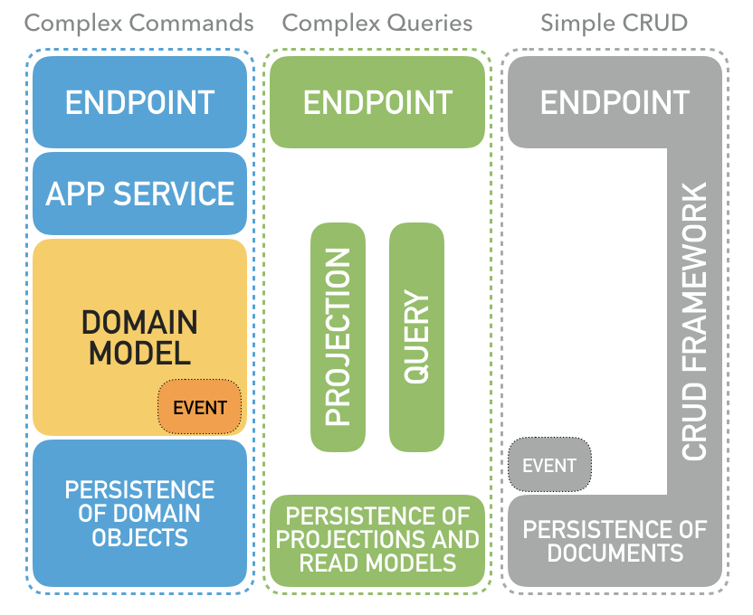
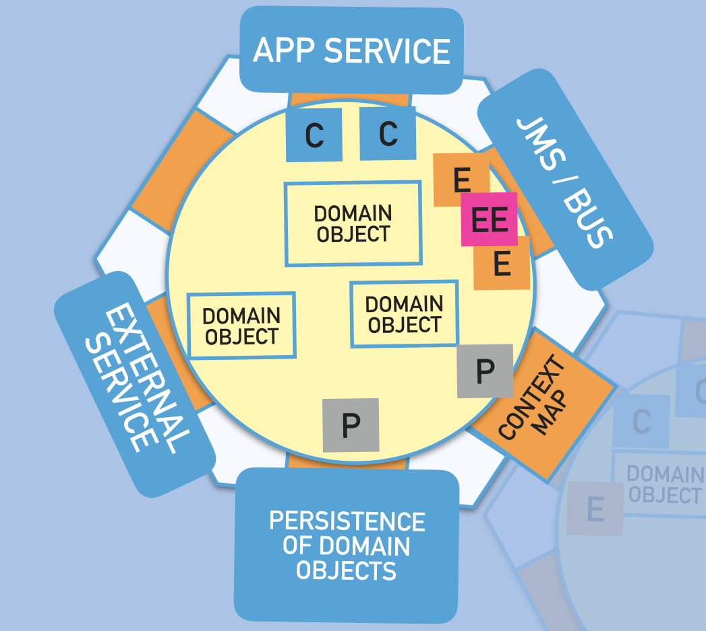
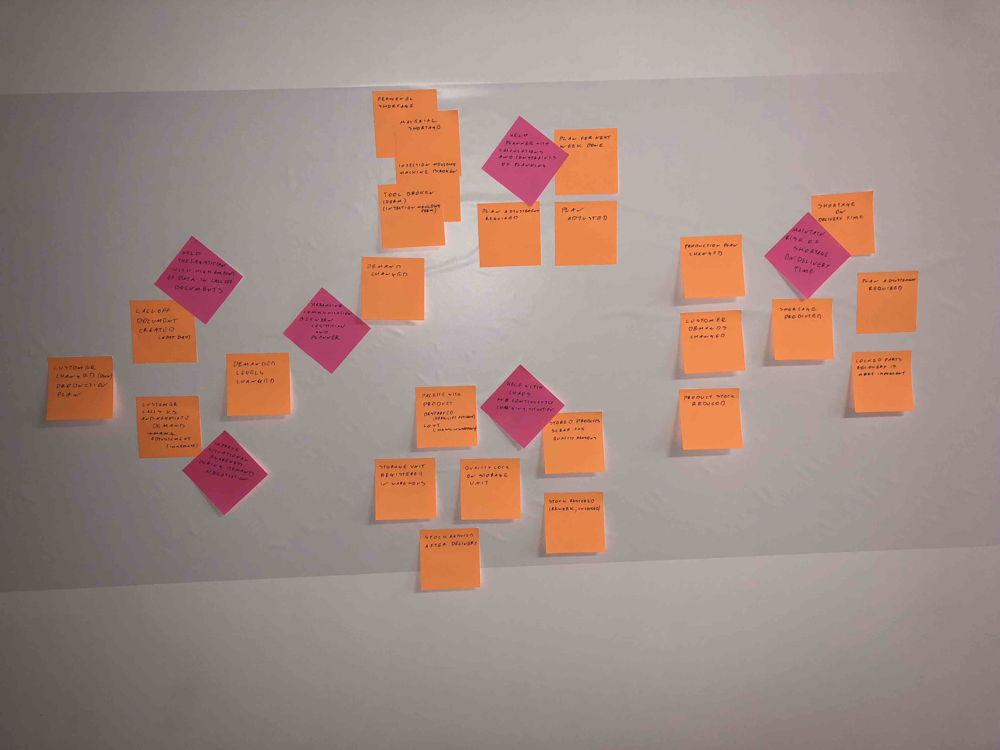

# The missing, complete example of Domain-Driven Design enterprise application

## Command Query CRUD Responsibility Segregation
Not every piece of software is equally important...
Not every piece will decide about company / product success or can cause not reversible
negative business consequences like materialise brand risk or money loses.
On the other hand scalability or non functional requirements are different for different activities in software.

To accommodate to those differences, separate architectural patterns are applied:

**Simple Create Read Update Delete functionality** are exposed with leverage of CRUD framework.

Goals of that approach:
- fast initial development,
- fast respond to typical changes (ex. „please add another 2 fields on UI”),
- exposure of high quality API.

Examples in code:
- CRUD-able document [ProductDescription](product-management-adapters/src/main/java/pl/com/dddbyexamples/factory/product/management/ProductDescription.java)
- persistence of document [ProductDescriptionEntity](product-management-adapters/src/main/java/pl/com/dddbyexamples/factory/product/management/ProductDescriptionEntity.java)
- CRUD exposed as DAO and REST endpoint [ProductDescriptionDao](product-management-adapters/src/main/java/pl/com/dddbyexamples/factory/product/management/ProductDescriptionDao.java)

**Complex Commands (business processing)** expressed in Domain Model which is embedded in hexagonal architecture.

Goals of that approach:
- enable approach with implementing the Domain Model in the first place, by adding infrastructure adapters later,
- keeping the Domain Model as simple as possible by protecting it from accidental complexity
caused by technological choices or transport models from external services / contexts,
- make the core business of application technology agnostic, enabling continues technology
migration and keeping long living projects up to date with fast evolving frameworks and libraries.

Examples of Domain Model in code:
- aggregate [ProductDemand](demand-forecasting-model/src/main/java/pl/com/dddbyexamples/factory/demand/forecasting/ProductDemand.java)
- entity [DailyDemand](demand-forecasting-model/src/main/java/pl/com/dddbyexamples/factory/demand/forecasting/DailyDemand.java)
- value object [Adjustment](demand-forecasting-model/src/main/java/pl/com/dddbyexamples/factory/demand/forecasting/Adjustment.java)
- policy [ReviewPolicy](demand-forecasting-model/src/main/java/pl/com/dddbyexamples/factory/demand/forecasting/ReviewPolicy.java)
- domain event [DemandedLevelsChanged](shared-kernel-model/src/main/java/pl/com/dddbyexamples/factory/demand/forecasting/DemandedLevelsChanged.java)

Examples of Ports in code:
- application service (primary port) [DemandService](demand-forecasting-model/src/main/java/pl/com/dddbyexamples/factory/demand/forecasting/DemandService.java)
- repository (secondary port) [ProductDemandRepository](demand-forecasting-model/src/main/java/pl/com/dddbyexamples/factory/demand/forecasting/ProductDemandRepository.java)
- domain events handling (secondary port) [DemandEvents](demand-forecasting-model/src/main/java/pl/com/dddbyexamples/factory/demand/forecasting/DemandEvents.java)

Examples of Adapters in code:
- REST endpoint for complex command (driving adapter)
  - command resource [DemandAdjustmentDao](demand-forecasting-adapters/src/main/java/pl/com/dddbyexamples/factory/demand/forecasting/command/DemandAdjustmentDao.java)
  - command handler [CommandsHandler](demand-forecasting-adapters/src/main/java/pl/com/dddbyexamples/factory/demand/forecasting/command/CommandsHandler.java)
- repository implementation (driven adapter) [ProductDemandORMRepository](demand-forecasting-adapters/src/main/java/pl/com/dddbyexamples/factory/demand/forecasting/ProductDemandORMRepository.java)
- events propagation (driven adapter) [DemandEventsPropagation](app-monolith/src/main/java/pl/com/dddbyexamples/factory/demand/forecasting/DemandEventsPropagation.java)

**Complex Query** implemented as direct and simple as possible by:
- fetching persistent read model expected by consumer, the read model is a projection of past domain event,
- read model composed at query execution time build directly from persistent form of Domain Model,
- mix of above: read model composed at query execution time build from pre-calculated persistent projections of domain event.

Additional complex calculations or projections can be partially delegated to the Domain Model if desired.

Goals of that approach:
- encapsulation of the Domain Model complexity by providing (simpler) consumer driven or published language API,
- freeing the Domain Model from exposing data for reads making the Domain Model simpler,
- improves reads performance and enable horizontal scalability.

Examples in code:
- projection of domain events to persistent read model [DeliveryForecastProjection](demand-forecasting-adapters/src/main/java/pl/com/dddbyexamples/factory/delivery/planning/projection/DeliveryForecastProjection.java)
- REST endpoint for persistent read model [DeliveryForecastDao](demand-forecasting-adapters/src/main/java/pl/com/dddbyexamples/factory/delivery/planning/projection/DeliveryForecastDao.java)
- read model composed at query execution time [StockForecastQuery](app-monolith/src/main/java/pl/com/dddbyexamples/factory/stock/forecast/StockForecastQuery.java)
- REST resource processor for NOT persistent read model [StockForecastResourceProcessor](app-monolith/src/main/java/pl/com/dddbyexamples/factory/stock/forecast/ressource/StockForecastResourceProcessor.java)

## Hexagonal Architecture
Only the most valuable part of that enterprise software is embedded in hexagonal architecture -
complex business processing modeled in form of the Domain Model.

**Application Services** - providing entry point to Domain Model functionality,
Application Services are ports for Primary / Driving Adapters like RESTfull endpoints.

**Domain Model** - Object Oriented (in that case) piece of software modeling business rules, invariants,
calculations and processing variants.
Thanks to hexagon can be as clean and simple as possible - separating essential complexity of pure business
from accidental complexity of technical choices, free of technical and convention constraints.

**Ports** - contract defined by Domain Model expressing expectations from external resources (services, database or other models).
Declared interfaces alongside with IN-OUT parameters are Ports for Secondary / Driven Adapters like repository implementation.

**Adapters** - integration of the technology (REST, database, external services, etc.) with the Domain Model.
Making useful application from the Domain Model and the technology.

## Implementing Domain Model in the first place
In most projects the biggest risk is lack of domain knowledge among developers. We all known Java,
databases and bunch of handy frameworks, but what about: Investment Banking, Automotive Manufacturing or even e-Commerce.

Let's face the risk at first, maintain and explore domain knowledge
with **Model Exploration Whirlpool** and build **Ubiquitous Language** with your executable **Domain Model**,
**Domain Stories** and **Specification by Examples** from day one.
Adding infrastructure and technology later is easy thanks to Hexagonal Architecture.

Simply starting from ZERO business knowledge through initial domain and opportunity exploration with **Big Picture Event Storming**:

after cleaning and trimming initial model to most valuable and needed areas: 

Deep dive in **Demand Forecasting** sub-domain with **Design Level Event Storming**:

is excellent canvas to cooperative exploration of:
- impacted and required actors,
- initial / desired system boundaries,
- actors interactions with system under design.

With use of **Domain Stories** and **Specification by Examples** it is easy to find:
- business rules and invariants,
- acceptance criteria,
- estimation of Domain Model depth,
- CRUD-suspected activities,
- missing parts.
