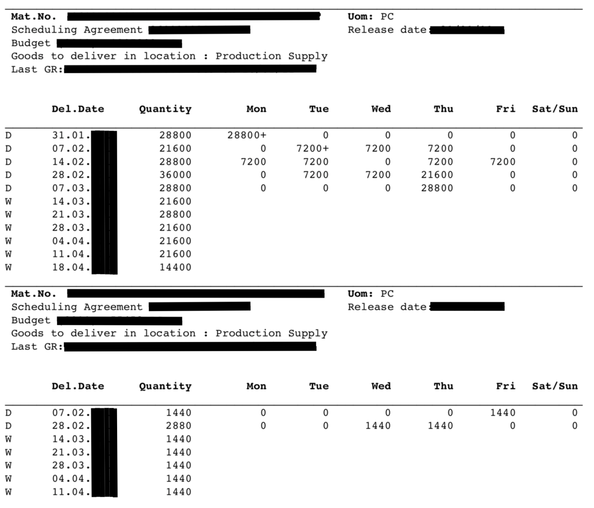

# Demand forecasting
Demand forecasting refers to predicting future the sales of the product. 

Demand forecasting, enables organization to take various business decision on operational level, such as:
- production planning,
- purchasing of materials,
- shortage prediction,
- product pricing,
- inventory optimization,
- business risk management.

But to benefit from being demand-driven, demanded values need to be predicted, collected and kept accurate according to dynamic conditions.

There is plenty of demand predicting approaches:
- Qualitative approaches:
  - Judgemental (surveys, specialist opinion, consensus methods)
  - Experimental (test marketing, customer buying database, customer panels)
- Quantitative:
  - Relationship (econometric models, life cycle models, input-output models)
  - Time Series (moving averages, exponential smoothing, threshold methods, GARCH, TBATS, adaptive models)
- Scenario Modeling: refining quantitative forecast with specific adjustments reflecting upcoming situation.

## Continuous demand forecasting
Continuous demand forecasting refers to automated,
continuous prediction no high granularity like demand for product-day-location.
Continuous calculation involve predictive modeling,
algorithmic modeling, pattern identification, scenario modeling and simulations
by combining selected predicting approaches depending on demands mathematical properties.

Review example [**demand forecasting
 expertise**](demand-forecasting-expertise.R) leveraging FactoryAnalytics and R-language.
Expertise is generating pdf document while fetching and posting data to REST endpoints of **demand-forecasting** bounded context.

Interactions with **demand-forecasting** bounded context can be found in source code:
- External event **demand forecasting
 expertise** is handled by port
  [DemandService.process(Document)](../../demand-forecasting-model/src/main/java/io/dddbyexamples/factory/demand/forecasting/DemandService.java)
- External event **forecast recalculated** is handled by port
  [DemandService.process(Document)](../../demand-forecasting-model/src/main/java/io/dddbyexamples/factory/demand/forecasting/DemandService.java)
- Command **adjust demand** is handled by port
  [DemandService.adjust(AdjustDemand)](../../demand-forecasting-model/src/main/java/io/dddbyexamples/factory/demand/forecasting/DemandService.java)
- Read model **stock forecast** is calculated on query time by
  [StockForecastQuery.get(RefNoId)](../../app-monolith/src/main/java/io/dddbyexamples/factory/stock/forecast/StockForecastQuery.java)

## Framework agreement and call‐off orders
Demands information can be collected based on framework agreement and call‐off orders.
In case of high volume production of low value consumables or materials,
an framework agreement with customer specifies contracted demand (on annual, quarterly or monthly granularity).
In addition call‐off order’s contains commitment values in short period of time
with higher granularity like product-day-location or product-week-location.
Call-off orders and be actualized continuous even on daily basis
replacing need for in house continuous demand forecasting.

Review example **call-of order** document:

Example document contains demand forecast for two products
- 5 weeks ahead daily demand for first
- 2 weeks ahead daily demand for second
and some weekly demands aggregates.

Interactions with **demand-forecasting** bounded context can be found in source code:
- External event **framework agreement signed** is handled by port
  [DemandService.process(Document)](../../demand-forecasting-model/src/main/java/io/dddbyexamples/factory/demand/forecasting/DemandService.java)
- External event **call-of order** is handled by port
  [DemandService.process(Document)](../../demand-forecasting-model/src/main/java/io/dddbyexamples/factory/demand/forecasting/DemandService.java)
- Command **adjust demand** is handled by port
  [DemandService.adjust(AdjustDemand)](../../demand-forecasting-model/src/main/java/io/dddbyexamples/factory/demand/forecasting/DemandService.java)
- Read model **stock forecast** is calculated on query time by
  [StockForecastQuery.get(RefNoId)](../../app-monolith/src/main/java/io/dddbyexamples/factory/stock/forecast/StockForecastQuery.java)
- Domain event **review required**
  [ReviewRequired](../../shared-kernel-model/src/main/java/io/dddbyexamples/factory/demand/forecasting/ReviewRequired.java)
  can be published via push notification to Logistician, and is stored as read model and exposed by REST endpoint
  [RequiredReviewDao.findByRefNoAndDecisionIsNull(String)](../../demand-forecasting-adapters/src/main/java/io/dddbyexamples/factory/demand/forecasting/command/RequiredReviewDao.java)
- Command **apply review decision** is handled by port
  [DemandService.review(ApplyReviewDecision)](../../demand-forecasting-model/src/main/java/io/dddbyexamples/factory/demand/forecasting/DemandService.java)

## Custom orders
For custom goods ordered in advance, order based demand can replace demand forecasting.
In case of lack of neither continuous demand forecasting nor call‐off orders,
customer orders can be treated as product-day-location demand
so any further processing requiring demand information may work normally.

Interactions with **demand-forecasting** bounded context can be found in source code:
- External event **demand forecasting
 expertise** is handled by port
  [DemandService.process(Document)](../../demand-forecasting-model/src/main/java/io/dddbyexamples/factory/demand/forecasting/DemandService.java)
- External event **order** is handled by port
  [DemandService.process(Document)](../../demand-forecasting-model/src/main/java/io/dddbyexamples/factory/demand/forecasting/DemandService.java)

## Manual management
Ad-hoc adjustments of demands on top of any existing forecasts.

Note that **adjust demand** can change demand for multiple days atomically.

Interactions with **demand-forecasting** bounded context can be found in source code:
- Command **adjust demand** is handled by port
  [DemandService.adjust(AdjustDemand)](../../demand-forecasting-model/src/main/java/io/dddbyexamples/factory/demand/forecasting/DemandService.java)
- Read model **stock forecast** is calculated on query time by
  [StockForecastQuery.get(RefNoId)](../../app-monolith/src/main/java/io/dddbyexamples/factory/stock/forecast/StockForecastQuery.java)

## Propagation of demand

